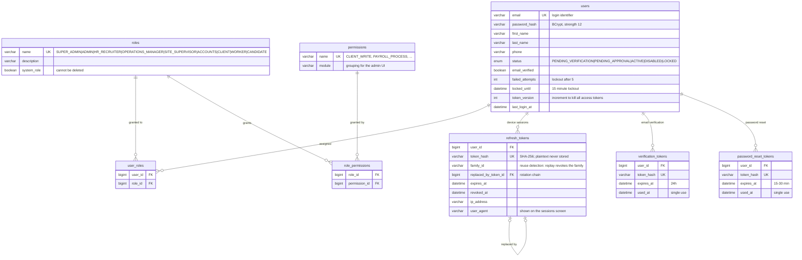
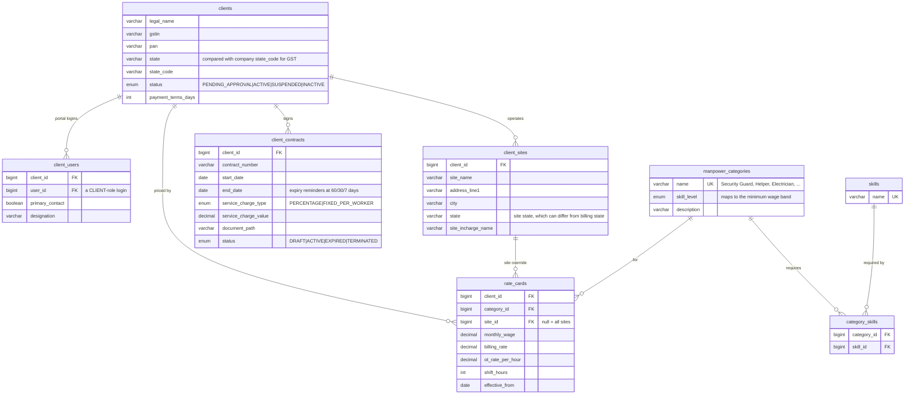
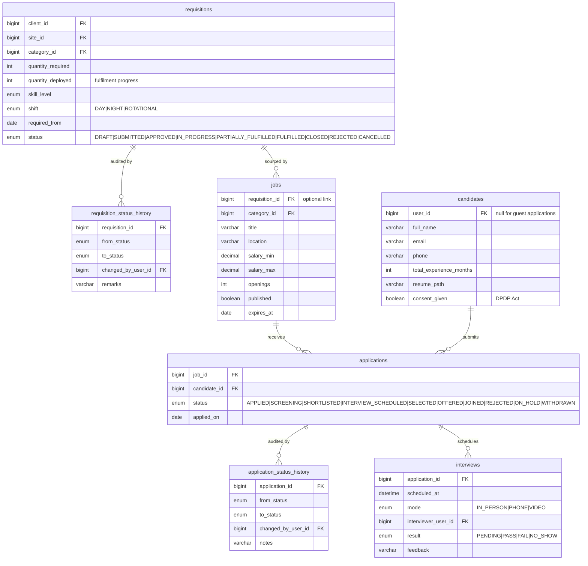
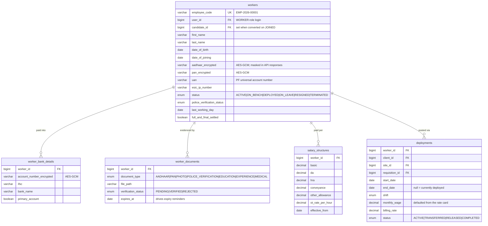
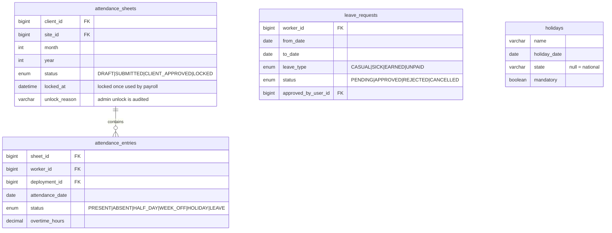
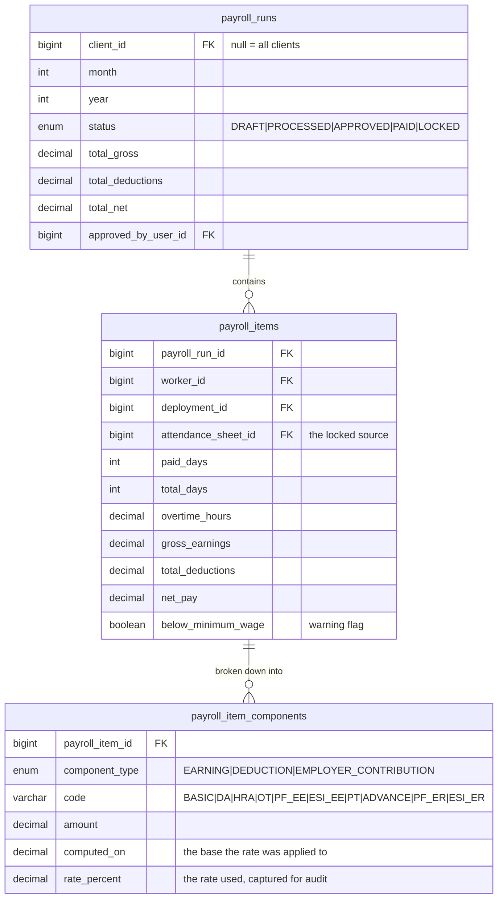
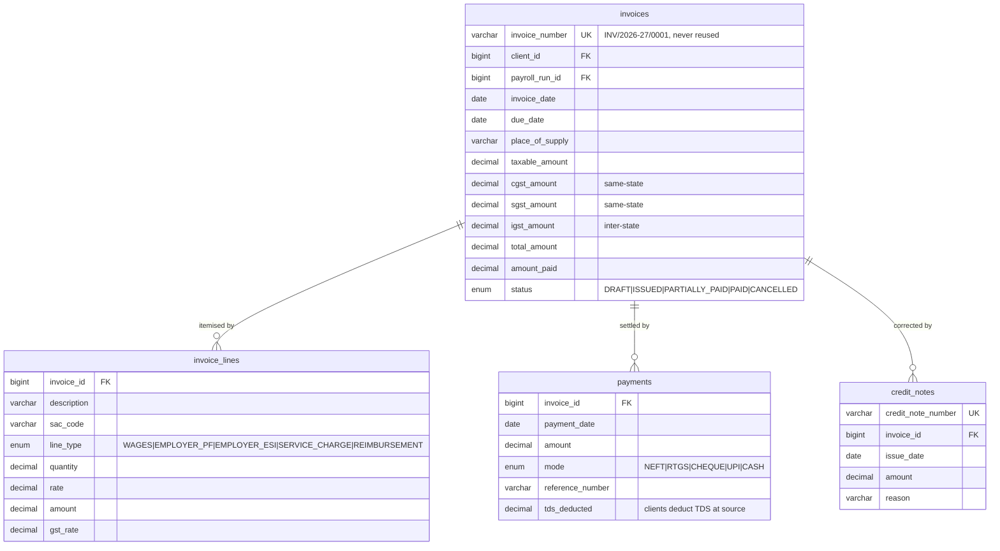

# ER diagram

Target schema for the whole platform. Tables are grouped by module, and each is
tagged with the phase that creates it — so this doubles as the schema roadmap.

**Created so far (Phases 1–3):**

- **V1** — `company_settings`
- **V2** — `users`, `roles`, `permissions`, `role_permissions`, `user_roles`,
  `refresh_tokens`, `verification_tokens`, `password_reset_tokens`, `audit_logs`
- **V3** — `manpower_categories`, `service_offerings`, `industries`,
  `testimonials`, `enquiries`, `contact_messages`, `documents`

Note that `manpower_categories` moved forward from Phase 4 to Phase 3: the public
enquiry form needs a category dropdown, and a free-text field would produce
unusable data on the one form the sales team actually reads. Phase 4 builds
skills and rate cards on top of it rather than creating it.

Two tables were also added that the original plan did not list —
`service_offerings` and `industries` — because the marketing copy has to be
editable without a deployment, which is the whole reason they are rows rather
than template files.

Every table inherits the `BaseEntity` columns and they are omitted from the
diagrams below to keep them readable:

| Column | Type | |
|---|---|---|
| `id` | `BIGINT` | PK, `AUTO_INCREMENT` |
| `created_at` | `DATETIME(6)` | not null |
| `updated_at` | `DATETIME(6)` | not null |
| `created_by` | `VARCHAR(150)` | principal, or `system` |
| `updated_by` | `VARCHAR(150)` | |
| `version` | `BIGINT` | optimistic locking |

Business records that must never be hard-deleted additionally carry `deleted`,
`deleted_at` and `deleted_by` (`SoftDeletableEntity`): clients, workers,
candidates, deployments, payroll runs, invoices.

---

## 1. Identity, access control and sessions — Phase 2

Authorization is checked on **permissions**, not role names
(`@PreAuthorize("hasAuthority('PAYROLL_PROCESS')")`), so the role→permission
mapping can change in the admin UI without touching code. Full matrix will be in
`docs/rbac.md`.

---

## 2. Configuration and statutory rates — Phases 1, 3 and 8

```mermaid
erDiagram
    company_settings {
        varchar legal_name
        varchar trade_name
        varchar state_code "GST state code; drives CGST+SGST vs IGST"
        varchar gstin
        varchar pan
        varchar pf_establishment_code
        varchar esi_establishment_code
        varchar bank_account_number "printed on invoices"
        varchar logo_path
    }
    statutory_configs {
        enum type "PF|ESI|LWF|BONUS|GRATUITY|GST|TDS"
        varchar state "null = applies nationally"
        decimal employee_percent
        decimal employer_percent
        decimal wage_ceiling "PF 15000, ESI 21000"
        decimal admin_charge_percent
        date effective_from "never edit history - add a new row"
        date effective_to
    }
    pt_slabs {
        varchar state
        decimal monthly_wage_from
        decimal monthly_wage_to
        decimal tax_amount
        int month "some states charge extra in one month"
        date effective_from
    }
    minimum_wages {
        varchar state
        enum skill_level "UNSKILLED|SEMI_SKILLED|SKILLED|HIGHLY_SKILLED"
        varchar zone "states band by area"
        decimal basic_per_day
        decimal vda_per_day "revised twice yearly"
        date effective_from
    }
    number_series {
        enum type "INVOICE|EMPLOYEE_CODE|CREDIT_NOTE"
        varchar financial_year "2026-27"
        varchar prefix
        bigint last_number "numbers are never reused"
    }
```

**No rate is ever hardcoded.** Every statutory value is a row with an
`effective_from` date, so recomputing a prior month uses the rates that applied
*then*. Correcting a rate means inserting a new row, never editing an old one.

---

## 3. Clients, sites, contracts and rate cards — Phase 4

---

## 4. Requisitions and recruitment — Phases 5 and 6

---

## 5. Workers and deployment — Phase 6

Sensitive columns (Aadhaar, PAN, bank account) are encrypted at rest with
AES-GCM through a JPA `AttributeConverter`, keyed by `FIELD_ENCRYPTION_KEY`, and
returned masked (`XXXX-XXXX-1234`) unless the caller holds the specific
permission to see them.

A worker must never hold two overlapping `ACTIVE` deployments —
`DateUtils.overlaps` (already built and tested in Phase 1) enforces it, treating
a null `end_date` as open-ended.

---

## 6. Attendance and leave — Phase 7

A sheet is unique on (site, month, year). Once `LOCKED` it is immutable; editing
requires an admin unlock with a recorded reason, because payroll has already
consumed it.

---

## 7. Payroll — Phase 8

`payroll_item_components` stores the rate and base used for every figure, not
just the result. Without that, a payslip queried a year later cannot be
explained — and PF/ESI rates change.

---

## 8. Billing and invoicing — Phase 9

GST: `CGST + SGST` when the client's state code equals the company's, otherwise
`IGST`. An issued invoice is never edited — corrections are credit notes, which
is both the GST requirement and a sound audit rule.

---

## 9. Compliance, documents, notifications and audit — Phases 3 and 10

```mermaid
erDiagram
    licences {
        enum licence_type "CONTRACT_LABOUR|PSARA|GST|PF|ESI|SHOP_ESTABLISHMENT|TRADE|ISO"
        varchar licence_number
        bigint client_id FK "contract labour licences are per establishment"
        date issue_date
        date expiry_date "reminders at 60/30/7 days"
        varchar document_path
        enum status "ACTIVE|EXPIRED|UNDER_RENEWAL"
    }
    statutory_challans {
        enum challan_type "PF|ESI|PT|LWF|TDS"
        int month
        int year
        decimal amount
        date paid_on
        varchar challan_number
        varchar document_path
        boolean return_filed
    }
    documents {
        enum owner_type "WORKER|CLIENT|CONTRACT|LICENCE|CANDIDATE|CHALLAN"
        bigint owner_id "polymorphic owner"
        varchar file_name
        varchar content_type "validated by content, not extension"
        bigint size_bytes
        varchar storage_key "resolved by StorageService"
    }
    enquiries {
        varchar company_name
        varchar contact_person
        varchar phone
        varchar email
        varchar city
        bigint category_id FK
        int number_of_workers
        date required_from
        enum status "NEW|CONTACTED|QUALIFIED|CONVERTED|CLOSED"
    }
    contact_messages { varchar name  varchar email  varchar subject  varchar message  boolean read }
    testimonials {
        varchar client_name
        varchar designation
        varchar content
        int rating
        boolean published
        varchar logo_path
    }
    notifications {
        bigint user_id FK
        varchar title
        varchar message
        enum type "INFO|WARNING|ACTION_REQUIRED"
        varchar link
        boolean read
    }
    audit_logs {
        varchar entity_type
        bigint entity_id
        enum action "CREATE|UPDATE|DELETE|LOGIN_SUCCESS|LOGIN_FAILURE|LOCKOUT|TOKEN_REUSE_DETECTED|ROLE_CHANGE"
        bigint user_id FK
        json old_values
        json new_values
        varchar ip_address
        varchar correlation_id "ties back to the request log"
    }
```

`audit_logs.correlation_id` is the same value `CorrelationIdFilter` puts on every
log line and in every error response — so an audit row, the application log and
the error the user saw can all be joined after the fact.

---

## Full table list by phase

| Phase | Tables |
|---|---|
| 1 | `company_settings` |
| 2 | `users`, `roles`, `permissions`, `user_roles`, `role_permissions`, `refresh_tokens`, `verification_tokens`, `password_reset_tokens`, `audit_logs` |
| 3 | `enquiries`, `contact_messages`, `testimonials`, `documents`, `service_offerings`, `industries`, `manpower_categories` (moved up from Phase 4) |
| 4 | `clients`, `client_users`, `client_sites`, `client_contracts`, `rate_cards`, `skills`, `category_skills` |
| 5 | `jobs`, `candidates`, `applications`, `application_status_history`, `interviews` |
| 6 | `requisitions`, `requisition_status_history`, `workers`, `worker_bank_details`, `worker_documents`, `salary_structures`, `deployments` |
| 7 | `attendance_sheets`, `attendance_entries`, `leave_requests`, `holidays` |
| 8 | `payroll_runs`, `payroll_items`, `payroll_item_components`, `statutory_configs`, `pt_slabs`, `minimum_wages`, `number_series` |
| 9 | `invoices`, `invoice_lines`, `payments`, `credit_notes` |
| 10 | `licences`, `statutory_challans`, `notifications` |
